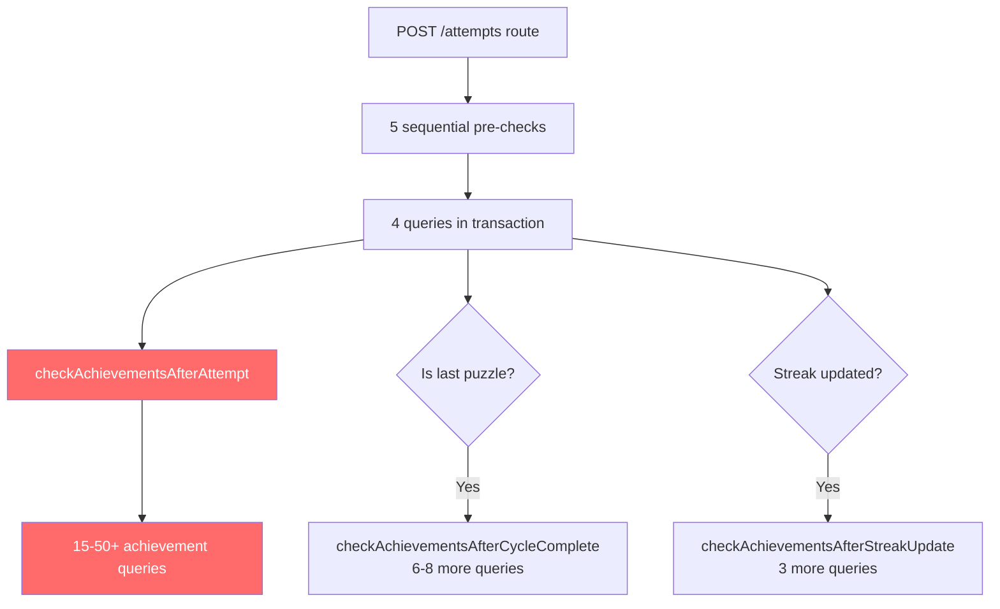
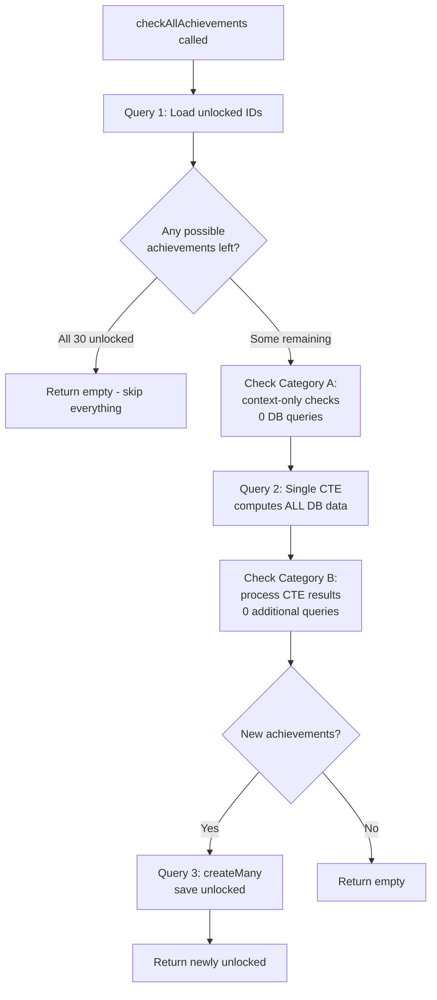

# Database Operations Optimization Plan

## Problem Analysis

After auditing every database operation in the codebase, the current state per puzzle attempt (the most frequent operation) is approximately **24-60+ Prisma queries**. The main offenders, in order of impact:




---

## Priority 1: Achievement Engine -- Replace with Single Raw SQL Query (Biggest Win)

**Files:** `[lib/achievements/engine.ts](lib/achievements/engine.ts)`, `[lib/achievements/index.ts](lib/achievements/index.ts)`

**Current problem:** Every puzzle attempt fires 15-50+ individual DB queries across 3 separate check functions (`checkAchievementsAfterAttempt`, `checkAchievementsAfterCycleComplete`, `checkAchievementsAfterStreakUpdate`), each loading unlocked IDs independently, each querying the user table independently, with a 17-theme loop that fires 34 count queries.

### New Architecture: 3 queries total (down from 15-50+)

Replace the entire engine with a new `checkAllAchievements()` function that:

1. **Query 1** -- Load already-unlocked achievement IDs (1 `findMany`)
2. **Query 2** -- Single raw SQL CTE query that computes ALL DB-dependent achievement data at once
3. **Query 3** -- Save newly unlocked achievements (1 `createMany`, only if there are new ones)

### Achievement Classification

All 30 achievements fall into two categories:

**Category A: Zero-DB (checked from context passed in by the caller)** -- 11 achievements:

- `speed-demon`, `lightning-fast` -- from `isCorrect` + `timeSpentMs`
- `early-bird`, `night-owl` -- from `attemptedAt` hour
- `perfectionist`, `sharp-shooter`, `no-mistakes` -- from cycle complete context (accuracy, totalPuzzles)
- `on-fire`, `unstoppable`, `consistent-trainer`, `dedicated` -- from streak context

**Category B: Need DB data** -- 18 achievements, but ALL can be computed with a single CTE query + the user object already loaded by the attempt route:

```sql
WITH theme_stats AS (
  -- Covers: theme-master-fork, theme-master-pin, theme-master-skewer, mate-master, versatile
  SELECT theme,
    COUNT(*) as total,
    COUNT(*) FILTER (WHERE a."isCorrect") as correct
  FROM "Attempt" a
  JOIN "PuzzleInSet" pis ON a."puzzleInSetId" = pis.id
  JOIN "Puzzle" p ON pis."puzzleId" = p.id
  JOIN "PuzzleSet" ps ON pis."puzzleSetId" = ps.id,
  LATERAL unnest(p.themes) AS theme
  WHERE ps."userId" = $1
  GROUP BY theme
),
recent_attempts AS (
  -- Covers: speed-streak (last 10), flawless-streak (last 25)
  SELECT a."isCorrect", a."timeSpent",
    ROW_NUMBER() OVER (ORDER BY a."attemptedAt" DESC) as rn
  FROM "Attempt" a
  JOIN "PuzzleInSet" pis ON a."puzzleInSetId" = pis.id
  JOIN "PuzzleSet" ps ON pis."puzzleSetId" = ps.id
  WHERE ps."userId" = $1
  ORDER BY a."attemptedAt" DESC
  LIMIT 25
),
total_attempts AS (
  -- Covers: tactical-prodigy (overall accuracy check)
  SELECT COUNT(*) as total
  FROM "Attempt" a
  JOIN "PuzzleInSet" pis ON a."puzzleInSetId" = pis.id
  JOIN "PuzzleSet" ps ON pis."puzzleSetId" = ps.id
  WHERE ps."userId" = $1
),
high_rating_correct AS (
  -- Covers: rating-climber
  SELECT COUNT(*) as count
  FROM "Attempt" a
  JOIN "PuzzleInSet" pis ON a."puzzleInSetId" = pis.id
  JOIN "Puzzle" p ON pis."puzzleId" = p.id
  JOIN "PuzzleSet" ps ON pis."puzzleSetId" = ps.id
  WHERE ps."userId" = $1 AND a."isCorrect" = true AND p.rating >= 1800
),
cycle_counts AS (
  -- Covers: cycle-complete, woodpecker-pro, woodpecker-master
  SELECT
    c."puzzleSetId",
    COUNT(*) FILTER (WHERE c."completedAt" IS NOT NULL) as completed
  FROM "Cycle" c
  JOIN "PuzzleSet" ps ON c."puzzleSetId" = ps.id
  WHERE ps."userId" = $1
  GROUP BY c."puzzleSetId"
),
cycle_times AS (
  -- Covers: improvement-king
  SELECT c."puzzleSetId", c."cycleNumber", c."totalTime"
  FROM "Cycle" c
  JOIN "PuzzleSet" ps ON c."puzzleSetId" = ps.id
  WHERE ps."userId" = $1
    AND c."completedAt" IS NOT NULL
    AND c."totalTime" IS NOT NULL
    AND c."puzzleSetId" = $2
  ORDER BY c."cycleNumber" ASC
)
SELECT json_build_object(
  'theme_stats', (SELECT json_agg(json_build_object('theme', theme, 'total', total, 'correct', correct)) FROM theme_stats),
  'recent_attempts', (SELECT json_agg(json_build_object('isCorrect', "isCorrect", 'timeSpent', "timeSpent", 'rn', rn)) FROM recent_attempts),
  'total_attempts', (SELECT total FROM total_attempts),
  'high_rating_correct', (SELECT count FROM high_rating_correct),
  'cycle_counts', (SELECT json_agg(json_build_object('puzzleSetId', "puzzleSetId", 'completed', completed)) FROM cycle_counts),
  'cycle_times', (SELECT json_agg(json_build_object('puzzleSetId', "puzzleSetId", 'cycleNumber', "cycleNumber", 'totalTime', "totalTime")) FROM cycle_times)
) as data;
```

This single query replaces **all** of these individual calls:

- `checkPuzzleCountAchievements` -- use user object (passed in, 0 queries)
- `checkWeeklyPuzzleCountAchievement` -- use user object (passed in, 0 queries)
- `checkSpeedStreakAchievement` -- from `recent_attempts` CTE
- `checkConsecutiveCorrectAchievement` -- from `recent_attempts` CTE
- `checkThemeAccuracyAchievements` -- from `theme_stats` CTE
- `checkThemeAccuracyExtendedAchievements` -- from `theme_stats` CTE
- `checkMultiThemeMasteryAchievement` -- from `theme_stats` CTE (count themes with 80%+ accuracy)
- `checkOverallAccuracyAchievement` -- from `total_attempts` CTE + user object
- `checkHighRatingCountAchievement` -- from `high_rating_correct` CTE
- `checkFirstCycleCompleteAchievement` -- from `cycle_counts` CTE
- `checkCyclesSameSetAchievement` -- from `cycle_counts` CTE
- `checkCyclesSameSetExtendedAchievement` -- from `cycle_counts` CTE
- `checkCycleTimeImprovementAchievement` -- from `cycle_times` CTE

### Functionality change: `rising-star` achievement

The `rising-star` achievement (top 100 on weekly leaderboard) currently loads 100 users from DB on every attempt. This will be **moved out of the attempt flow** and checked instead when the user visits the leaderboard page (`/api/leaderboard`). The achievement still works; it just unlocks when the user views the leaderboard rather than mid-puzzle. This removes a `findMany` of 100 user rows from every attempt.

### New unified function signature

```typescript
interface AchievementContext {
  // From attempt
  isCorrect: boolean;
  timeSpentMs: number;
  attemptedAt: Date;
  puzzleThemes: string[];
  puzzleRating: number;
  // From user (passed in, no extra query)
  user: {
    id: string;
    totalCorrectAttempts: number;
    weeklyCorrectAttempts: number;
    totalXp: number;
    weeklyXp: number;
  };
  // Cycle complete context (optional)
  cycleComplete?: {
    puzzleSetId: string;
    cycleNumber: number;
    accuracy: number;
    totalPuzzles: number;
    correctPuzzles: number;
  };
  // Streak context (optional)
  streak?: {
    currentStreak: number;
    longestStreak: number;
  };
}

async function checkAllAchievements(context: AchievementContext): Promise<UnlockedAchievement[]>
```

### After optimization flow




**Result: 15-50+ queries per attempt becomes exactly 2-3 queries.**

---

## Priority 2: Attempt Recording Route Optimization

**File:** `[app/api/training/puzzle-sets/[setId]/cycles/[cycleId]/attempts/route.ts](app/api/training/puzzle-sets/[setId]/cycles/[cycleId]/attempts/route.ts)`

**Current problem:** 5 sequential DB queries before the transaction even begins, including loading ALL puzzles in the set (100-300 rows).

### 2a. Combine user lookup + validation into 2 parallel queries

Replace the 5 sequential queries with 2 parallel queries after auth:

```typescript
const { userId } = await auth();
// Query 1: user (needed for ownership check)
const user = await prisma.user.findUnique({
  where: { clerkId: userId },
  select: { id: true, totalCorrectAttempts: true, weeklyCorrectAttempts: true,
            currentStreak: true, longestStreak: true, lastTrainedDate: true,
            weeklyCorrectStartDate: true, totalXp: true, weeklyXp: true,
            weeklyXpStartDate: true, streakUpdatedAt: true, currentLevel: true,
            hasCompletedOnboarding: true },
});

// Queries 2+3 in parallel (no dependency on each other)
const [puzzleInSet, cycle, existingAttempt] = await Promise.all([
  prisma.puzzleInSet.findUnique({
    where: { id: puzzleInSetId },
    include: {
      puzzle: { select: { themes: true, rating: true } },
      attempts: { orderBy: { attemptedAt: 'desc' }, take: 1,
                  select: { isCorrect: true, timeSpent: true } },
    },
  }),
  prisma.cycle.findUnique({ where: { id: cycleId } }),
  prisma.attempt.findFirst({ where: { cycleId, puzzleInSetId } }),
]);
// Validate ownership: puzzleInSet.puzzleSetId === setId, check via a joined query or separate
```

### 2b. Remove `include: { puzzles: true }` from puzzleSet lookup

The current code loads the full puzzle set with ALL puzzles (line 61-66) just to check `puzzleSet.userId !== user.id`. Replace with a simple ownership check that doesn't load any puzzles:

```typescript
// Instead of loading all puzzles, just verify ownership via puzzleInSet
if (puzzleInSet.puzzleSetId !== setId) { return 400 }
// Verify ownership via a lightweight check
```

### 2c. Pass user object directly to achievement engine

The user object (with `totalCorrectAttempts`, `weeklyCorrectAttempts`, etc.) is already loaded in step 2a. Pass it directly to `checkAllAchievements()` so it doesn't need to re-query.

**Savings: From 5 sequential queries (+ large data loads) to 1 + 2 parallel queries with minimal data.**

---

## Priority 3: Client-Side Duplicate API Calls

### 3a. Fix `useXp` redundant `/api/user` call

**Files:** `[hooks/use-xp.ts](hooks/use-xp.ts)`

The `useXp` hook fetches `/api/user` with query key `['xp']`, while the dashboard fetches the same endpoint with query key `['user']`. Different keys = different cache entries = the same endpoint called twice on every page load.

**Fix:** Refactor `useXp` to share the `['user']` query key and use `select` to derive XP data:

```typescript
export function useXp() {
  return useQuery<XpData>({
    queryKey: ['user'],
    queryFn: async () => {
      const res = await fetch('/api/user')
      if (!res.ok) throw new Error('Failed to fetch user')
      return res.json()
    },
    select: (data) => ({
      totalXp: data.user.totalXp,
      currentLevel: data.user.currentLevel,
      weeklyXp: data.user.weeklyXp,
      levelProgress: getLevelProgress(data.user.totalXp),
      levelTitle: getLevelTitle(data.user.currentLevel),
    }),
    staleTime: 60000,
  })
}
```

**Savings: Eliminates 1 redundant `/api/user` call on every authenticated page (sidebar renders `useXp` globally).**

### 3b. Increase stale times for infrequently changing data

- `achievements`: 1 min -> 5 min (only changes on attempt)
- `streak`: 1 min -> 5 min (only changes once per day)
- `progress`: 30s -> 2 min (only changes on attempt)

### 3c. Stop `next-puzzle` from invalidating itself after every attempt

In `[hooks/use-training-session.ts](hooks/use-training-session.ts)`, the `onSuccess` handler calls `queryClient.invalidateQueries({ queryKey: ['next-puzzle'] })` after the optimistic update already set the prefetched puzzle data. This causes an unnecessary server round-trip.

**Fix:** Remove the invalidation. The optimistic update is already setting the correct data, and the server response can be used to update the cache via `setQueryData` if needed.

---

## Priority 4: Optimize Heavy Data-Loading Routes

### 4a. Next-puzzle: Stop loading ALL puzzles

**File:** `[app/api/training/puzzle-sets/[setId]/next-puzzle/route.ts](app/api/training/puzzle-sets/[setId]/next-puzzle/route.ts)`

Currently loads every puzzle in the set (100-300 rows) with full puzzle data, then filters in JavaScript. Replace with targeted queries:

```typescript
const attemptedIds = await prisma.attempt.findMany({
  where: { cycleId },
  select: { puzzleInSetId: true },
});
const attemptedSet = new Set(attemptedIds.map(a => a.puzzleInSetId));

const nextPuzzles = await prisma.puzzleInSet.findMany({
  where: { puzzleSetId: setId, id: { notIn: [...attemptedSet] } },
  orderBy: { position: 'asc' },
  take: 2,
  include: { puzzle: true },
});
```

**Savings: 2 rows loaded instead of 100-300.**

### 4b. Progress route: Use aggregation instead of loading all attempts

**File:** `[app/api/progress/[setId]/route.ts](app/api/progress/[setId]/route.ts)`

Currently loads ALL puzzles with ALL their attempts (potentially 1500+ rows). Use Prisma's `_count` and aggregation or raw SQL for theme performance/problem puzzles.

### 4c. Review route: Filter at DB level

**File:** `[app/api/training/review/route.ts](app/api/training/review/route.ts)`

Currently loads ALL puzzles-in-sets with attempts, then filters in JavaScript. Push the success rate filtering to the database using raw SQL or computed where clauses.

---

## Priority 5: Eliminate Repeated User Lookups

### 5a. Create auth helper with minimal select

```typescript
// lib/auth.ts
export async function getAuthenticatedUser() {
  const { userId } = await auth()
  if (!userId) return null
  return prisma.user.findUnique({
    where: { clerkId: userId },
    select: { id: true },
  })
}
```

### 5b. Use `select` in user lookups across all routes

Most routes fetch the full user row but only need `id` for ownership checks. Add `select: { id: true }` where appropriate (streak, achievements, review, cycles, delete, etc.).

---

## Expected Impact Summary

- Achievement engine: **15-50+ queries -> 2-3 queries** (~95% reduction)
- Attempt pre-checks: **5 sequential queries -> 1 + 2 parallel** (~50% reduction)
- Client duplicate calls: **2x `/api/user` -> 1x** (50% reduction per page)
- Next-puzzle data load: **100-300 rows -> 2 rows** (~99% reduction)
- Stale time increases: fewer refetches across the board

**Conservative estimate: Total DB operations reduced by 80-90% per active training session.**